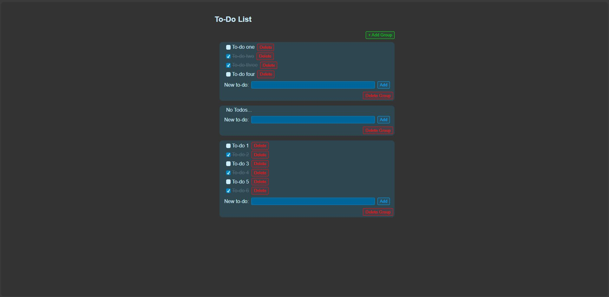
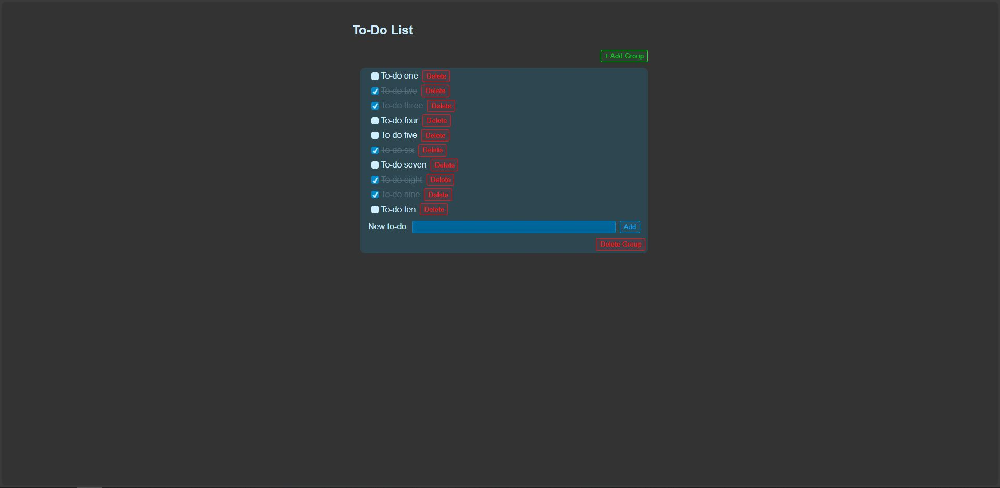
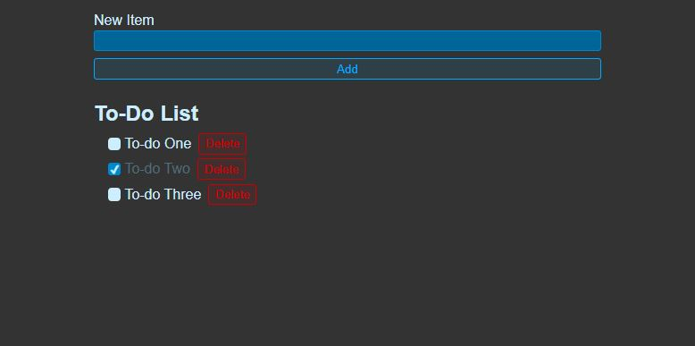

# React To-Do app.

---

### Description

This project is a React-based to-do application created to explore and strengthen my skills in JavaScript and React development. Based on a [YouTube tutorial](https://www.youtube.com/watch?v=Rh3tobg7hEo&t=1s) by _Web Dev Simplified_, the app enables users to add, remove, and mark tasks as complete, with data persistence achieved through local storage. Working on this project allowed me to delve deeper into React concepts such as managing dynamic user input, implementing local storage for offline functionality, and building interactive components.

### Screenshots

  
  &nbsp; &nbsp; &nbsp; &nbsp;
  

(_full size images can be found [here](./screenshots)_)

### Functionality

- Add and delete to-do groups.
- Add and delete to-do tasks.
- Check off completed to-dos.
- Save the state of the app. using local storage.

### Modifications

After finishing this project and learning more about React, my main focus was to explore components, their relationships, and learn more about variables and the flow of the code. So, aside from small visual updates, the modifications I did were focussed on this. Creating another level of hierarchy - the to-do group. I created to-do groups, and their corresponding controls to act as a wrapper for the basic to-do elements. Re-using previous components as needed to achieve this. The unmodified version can be seen in the image below.

    

### Requirements

- A web browser
- Node.js
- git

### How to use

To use the application, you can either go [here](https://luke663.github.io/react-todo/) to see the app. hosted via GitHub pages or host it locally by completing the following steps:

- Clone the application.
  - Open a command terminal
  - Go to the directory on your computer where you wish to put the repository.
  - Run the commands:
    - git clone https\://github\.com/Luke663/react-todo
    - cd react-todo
    - npm install
- Run the application.
  - Run the command:
    - npm run dev
  - Click (or copy and paste into a browser) the local address that appears in the terminal.

### License

This is a demonstration project and not intended for collaboration, as such a license has not been added meaning the default copyright laws apply and no one may reproduce, distribute, or create derivative works from this work.
